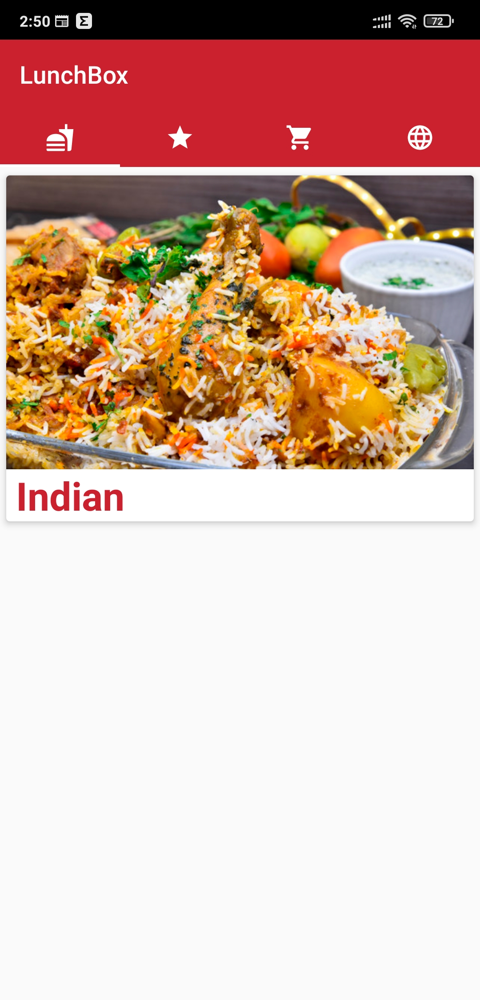
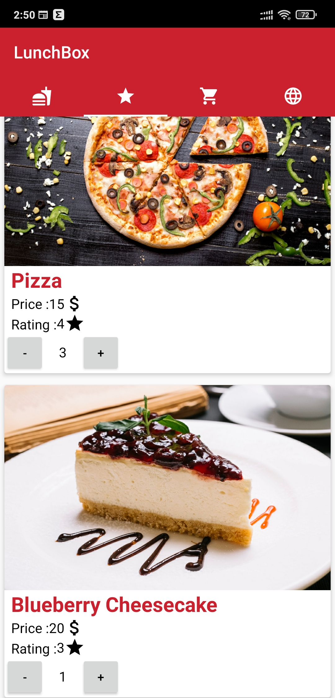
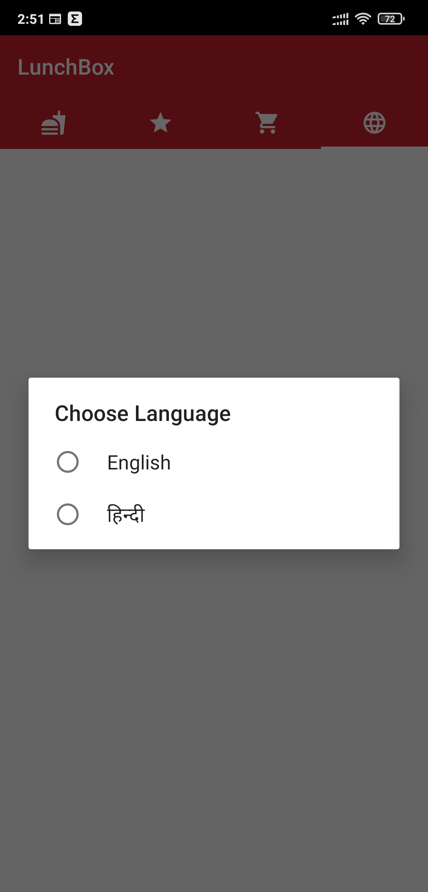
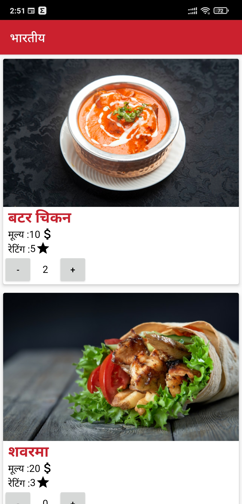

# RestaurantsApplication
📚🌐Allow a user to get a list of dishesa and  display them to the user in Recyclerview
# Screenshots
<table>
<tr>
<td></td>
<td></td>
</tr>
<tr>
<td></td>
<td></td>
</tr>
<tr>
<td></td>
</tr>
</table>
